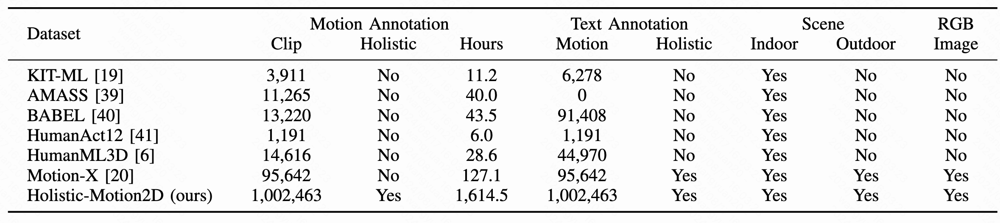

# Holistic-Motion2D
This is the official code release of **[Holistic-Motion2D: Scalable Whole-body Human Motion Generation in 2D Space](https://arxiv.org/abs/2406.11253)** by [Yuan Wang](https://github.com/wangyuan123ac)\*, [Zhao Wang](https://kyfafyd.wang/)\*, [Junhao Gong](https://b1ueorange.github.io/jhgong.github.io)\*, [Di Huang](https://dihuang.me/), [Tong He](https://tonghe90.github.io/), [Wanli Ouyang](https://wlouyang.github.io/), Jile Jiao, Xuetao Feng, [Qi Dou](https://www.cse.cuhk.edu.hk/~qdou), [Shixiang Tang](https://scholar.google.com.tw/citations?user=TJ4ihdkAAAAJ)†, [Dan Xu](https://www.danxurgb.net/).

## 📝 Changelog
- __[2024.06.20]__: 🔥 Release a sample dataset. Find in [Data Page](https://github.com/Holistic-Motion2D/Holistic-Motion2D). Code is coming soon!
- __[2024.09.10]__: 🔥 Release the introduction and demo representations of our work, Holistic-Motion2D.

> We present the first time a large-scale human motion benchmark, **Holistic-Motion2D**, including over 1M in-the-wild motion sequences, each paired with high-quality whole-body or partial pose annotations and textual descriptions.

- Our Holistic-Motion2D dataset provides not only fine-grained and comprehensive whole-body motion annotations but also high-resolution information on the **face** and **hands**. We use multi-source datasets with images of varying resolutions to jointly train a human generative foundation model.

- Our **Holistic-Motion2D** encompasses rich scenes, ranging from professional sports (*playing tennis*, *skiing*) and general daily actions (*haircut*, *brushing teeth*) to complex human-scene interactions (*lying down*, *wall push-ups*), capturing diverse environments such as indoor/outdoor landscapes, and dynamic action scenes.

- The video quantity of our Holistic-Motion2D is $10\times$ larger than the previously largest 3D motion dataset Motion-X. Compared to MotionX, our Holistic-Motion2D features more sophisticated actions, longer motion sequences, and increased diversity. 

- **Holistic-Motion2D** is collected from **11 public video datasets** along with two image datasets annotated by whole-body poses. Across 1M sequence-level motion sequences derived from in-the-wild scenarios, Holistic-Motion2D delivers **1M** 2D whole-body pose annotations, complemented by **1M** semantic descriptions.

# Dataset Collection and Processing

- The data collection pipeline includes holistic 2D motion and caption generation. This pipeline involves several pivotal stages: 1) gathering large-scale videos, 2) annotating 2D whole-body keypoints and confidence scores, 3) filtering high-quality motion sequences, 4) designing text prompts via the Large Language Model, 5) generating descriptive captions for sequence-level
  movements, 6) executing the manual inspections. 

> All data will be downloaded on Open-Data Lab:

| Path                                                         |   Size    |     Files | Format | Description                                   |
| :----------------------------------------------------------- | :-------: | --------: | :----: | :-------------------------------------------- |
| [Holistic-Motion-2D-dataset](https://drive.google.com/open?id=1u2xu7bSrWxrbUxk-dT-UvEJq8IjdmNTP) | 118.15 GB | 1,464,278 |        | Main folder                                   |
| ├  [kpfiles](https://drive.google.com/open?id=16N0RV4fHI6joBuKbQAoG34V_cQk7vxSA) | 118.06 GB |   400,790 |        | Sequence of key points for character motion   |
| ├ ├  [UCF101](https://drive.google.com/open?id=1ZX7QOy6LZuTLTnsOtQk-kmKq2-69l5hu) |  5.03 GB  |    11,391 | Pickle | Whole-body key-points for UCF101              |
| ├ ├  [CAER](https://drive.google.com/open?id=1ZX7QOy6LZuTLTnsOtQk-kmKq2-69l5hu) | 153.81 MB |     3,542 | Pickle | Facial key-points for CAER                    |
| ├ ├  [K400](https://drive.google.com/open?id=1ZX7QOy6LZuTLTnsOtQk-kmKq2-69l5hu) | 55.54 GB  |   152,798 | Pickle | Whole-body key-points for Kinetics-400        |
| ├ ├  [InternVid](https://drive.google.com/open?id=1ZX7QOy6LZuTLTnsOtQk-kmKq2-69l5hu) | 44.02 GB  |    85,665 | Pickle | Whole-body key-points for InternVid           |
| ├ ├  [K700](https://drive.google.com/open?id=1ZX7QOy6LZuTLTnsOtQk-kmKq2-69l5hu) |     0     |         0 | Pickle | Whole-body key-points for Kinetics-700        |
| ├ ├  [IDEA400](https://drive.google.com/open?id=1ZX7QOy6LZuTLTnsOtQk-kmKq2-69l5hu) |  6.33 GB  |    12,025 | Pickle | Whole-body key-points for IDEA400             |
| ├ ├  [sthv2](https://drive.google.com/open?id=1ZX7QOy6LZuTLTnsOtQk-kmKq2-69l5hu) | 900.19 MB |   106,661 | Pickle | Hand key-points for Something-to-Something-v2 |
| ├ ├  [UBody](https://drive.google.com/open?id=1ZX7QOy6LZuTLTnsOtQk-kmKq2-69l5hu) |  3.21 GB  |     5,195 | Pickle | Whole-body key-points for UBody               |
| ├ ├  [DFEW](https://drive.google.com/open?id=1ZX7QOy6LZuTLTnsOtQk-kmKq2-69l5hu) |  1.68 GB  |    15,524 | Pickle | Facial key-points for DFEW                    |
| ├  [texts](https://drive.google.com/open?id=1tg-Ur7d4vk1T8Bn0pPpUSQPxlPGBlGfv) | 101.05 MB | 1,063,488 |        | Caption for character motion video            |
| ├ ├  [UCF101](https://drive.google.com/open?id=1ZX7QOy6LZuTLTnsOtQk-kmKq2-69l5hu) |  4.68 MB  |    24,711 |  TXT   | Texts for UCF101                              |
| ├ ├  [CAER](https://drive.google.com/open?id=1ZX7QOy6LZuTLTnsOtQk-kmKq2-69l5hu) | 32.16 KB  |     4,574 |  TXT   | Texts for CARE                                |
| ├ ├  [K400](https://drive.google.com/open?id=1ZX7QOy6LZuTLTnsOtQk-kmKq2-69l5hu) |  40.6 MB  |   215,479 |  TXT   | Texts for Kinetics-400                        |
| ├ ├  [InternVid](https://drive.google.com/open?id=1ZX7QOy6LZuTLTnsOtQk-kmKq2-69l5hu) | 20.52 MB  |   421,894 |  TXT   | Texts for InternVid                           |
| ├ ├  [K700](https://drive.google.com/open?id=1ZX7QOy6LZuTLTnsOtQk-kmKq2-69l5hu) | 22.75 MB  |   141,611 |  TXT   | Texts for Kinetics-700                        |
| ├ ├  [IDEA400](https://drive.google.com/open?id=1ZX7QOy6LZuTLTnsOtQk-kmKq2-69l5hu) |  2.96 MB  |    12,025 |  TXT   | Texts for IDEA400                             |
| ├ ├  [sthv2](https://drive.google.com/open?id=1ZX7QOy6LZuTLTnsOtQk-kmKq2-69l5hu) |  8.05 MB  |   220,848 |  TXT   | Texts for Something-to-Something-v2           |
| ├ ├  [UBody](https://drive.google.com/open?id=1ZX7QOy6LZuTLTnsOtQk-kmKq2-69l5hu) |  1.01 MB  |     5,974 |  TXT   | Texts for UBody                               |
| ├ ├  [DFEW](https://drive.google.com/open?id=1ZX7QOy6LZuTLTnsOtQk-kmKq2-69l5hu) | 456.1 KB  |    16,372 |  TXT   | Texts for DFEW                                |

# 2D text-driven whole-body motion generation model

- Our Text-drivEN whole-boDy motion genERation (**Tender**), is tailored for 2D whole-body human motion synthesis. This model incorporates two novel designs to enhance the quality of generated motion: Part-aware Attention for Motion Variational Auto-Encoder (PA-VAE) and Confidence-Aware Generation (CAG).

<table>
  <tr>
    <td>
      </img>
    </td>
    <td>
      </img>
    </td>
    <td>
      </img>
    </td>
    <td style="text-align:center;">
      </img>
    </td>
  </tr>
  <tr>
    <td>
      </img>
    </td>
    <td>
      </img>
    </td>
    <td>
      </img>
    </td>
    <td style="text-align:center;">
      </img>
    </td>
  </tr>
  <tr>
    <td style="text-align:center;">
      MDM
    </td>
    <td style="text-align:center;">
      MLD
    </td>
    <td style="text-align:center;">
      T2M-GPT
    </td>
    <td style="text-align:center;">
      Tender(Ours)
    </td>
  </tr>
</table>

- Notably, Tender consistently outperforms these benchmarks by generating more vivid and lifelike human motion sequences. Our Tender not only captures the nuanced dynamics of human movement but also enhances the fidelity and temporal consistency of the motions.

# Downstream Applications

<table>
  <tr>
    <td>
      </img>
    </td>
    <td>
      </img>
    </td>
  </tr>
  <tr>
    <td>
      </img>
    </td>
    <td>
      </img>
    </td>
  </tr>
</table>

- Using MagicAnimate, we dynamically animate a human character by applying our generated pose sequences, resulting in
  exceptionally lifelike and fluid animations that demonstrate the seamless integration of our Tender model with real-time video generation tools.

<table>
  <tr>
    <td>
      </img>
    </td>
    <td>
      </img>
    </td>
    <td>
      </img>
    </td>
  </tr>
  <tr>
    <td>
      </img>
    </td>
    <td>
      </img>
    </td>
    <td>
      </img>
    </td>
  </tr>
</table>
- We employ MotionBERT to elevate these 2D human motions into 3D space, showcasing our model’s ability to facilitate complex 3D pose estimations. The lifted 3D motions maintain a high degree of smoothness and fidelity, making them suitable for applications in virtual reality (VR) and augmented reality (AR), where immersive and accurate 3D representations are essential.

# License

- **Data License Confirmation and Author Responsibility**. 
  - All the Holistic-Motion2D (including **JSON metadata,** **download script**, and **documentation**) is distributed under the [CC-BY-NC-SA](https://creativecommons.org/licenses/by-nc-sa/4.0/) (Attribution-NonCommercial-ShareAlike) license to ensure its legitimate and widespread use. 
  - For the sub-datasets of Holistic-Motion2D, we would ask the user to read the original license of each original dataset, and we would only provide our annotated result to the user with the approvals from the original Institution. We confirm that our Holistic-Motion2D does not contain any personally identifiable information or offensive content.
  - You can **use, redistribute, and adapt it for non-commercial purposes**, as long as you (a) give appropriate credit by **citing our paper**, (b) **indicate any changes** that you've made, and (c) distribute any derivative works **under the same license**.
- **Code License**. The code for pre-processing and training our Tender model uses the MIT license. Please refer to the [GitHub repository](https://holistic-motion2d.github.io/) for license details.

